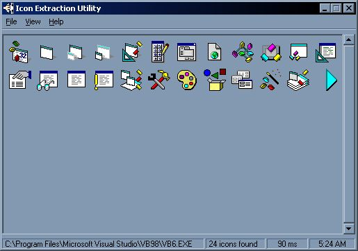



## Icon Extraction Utility

### Description

Extract any or all icons from executables and dynamic link libraries. Includes most-recently-used file list, ini file usage, and a small HTML help page. Nothing groundbreaking here, I wanted a utility like this with these functions. Plus it's my first attempt at an HTML help file. I've been using it for a while. I made some tweaks to it and decided to release it.

[Updated to allow for scrolling through large number of icons.]
 
### More Info
 

             |
---                |---
**Submitted On**   |2005-01-26 05:31:16
**By**             |[CubeSolver](https://github.com/Planet-Source-Code/PSCIndex/blob/master/ByAuthor/cubesolver.md)
**Level**          |Intermediate
**User Rating**    |5.0 (15 globes from 3 users)
**Compatibility**  |VB 6\.0
**Category**       |[Complete Applications](https://github.com/Planet-Source-Code/PSCIndex/blob/master/ByCategory/complete-applications__1-27.md)
**World**          |[Visual Basic](https://github.com/Planet-Source-Code/PSCIndex/blob/master/ByWorld/visual-basic.md)
**Archive File**   |[Icon\_Extra1844361262005\.zip](https://github.com/Planet-Source-Code/cubesolver-icon-extraction-utility__1-57400/archive/master.zip)

